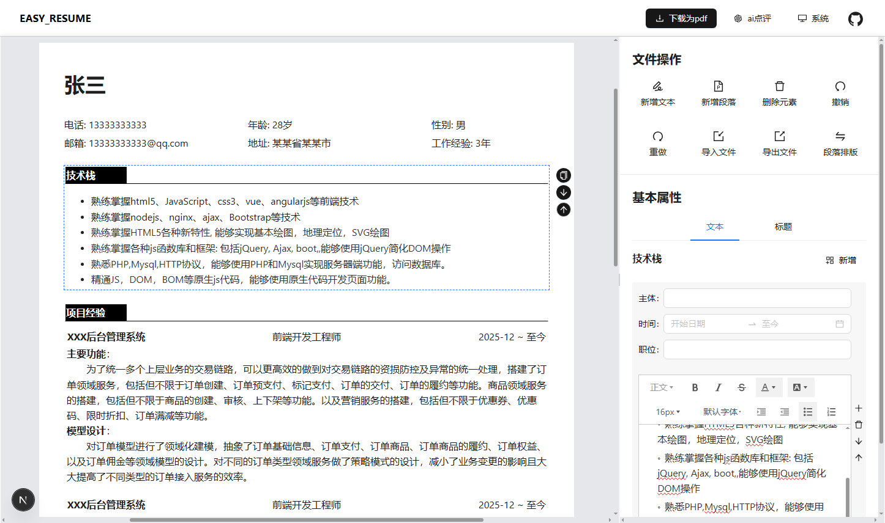
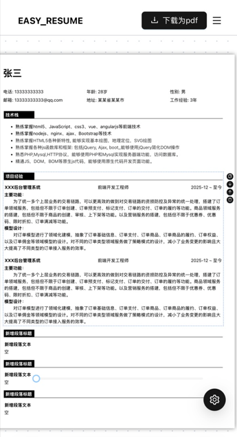

# easy_resume

make it easier for you to create your resume

    
    <!--  -->

## 功能介绍
- 🎉 基于 Next.js 构建，性能稳定，体验流畅
- ✨ 简洁直观的用户界面，操作清晰，零门槛上手，开箱即用
- 💻 多端响应式布局，完美适配 PC 与移动端，跨屏体验始终如一
- 🔒  支持数据本地存储，充分保障用户隐私与数据安全
- ✈  接入 DeepSeek-Chat，智能过滤与辅助生成ai测评
- 🤝 支持可扩展的简历模板体系，编写与维护更加高效
- 🧩 持续迭代与优化，功能与体验不断完善

## 问题反馈
- 请提交[issue](https://github.com/Srhui20/easy_resume/issues),并附上详细描述，方便我们快速定位和解决。